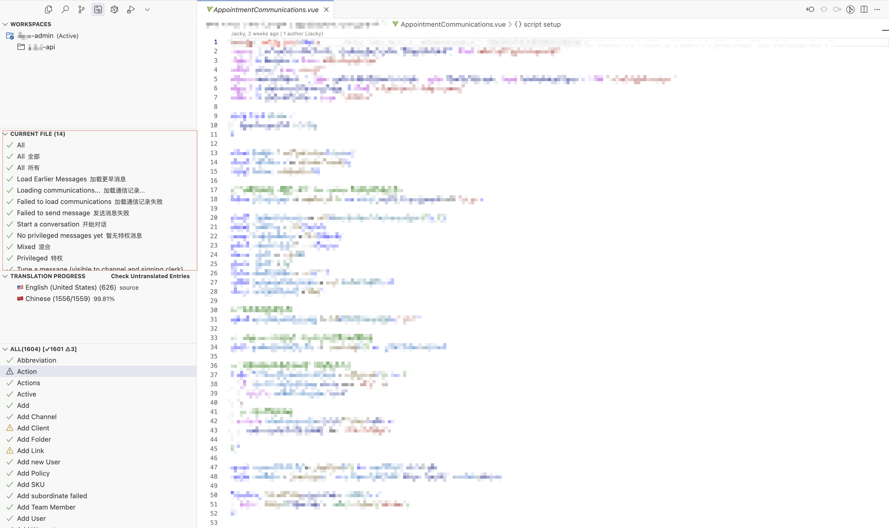
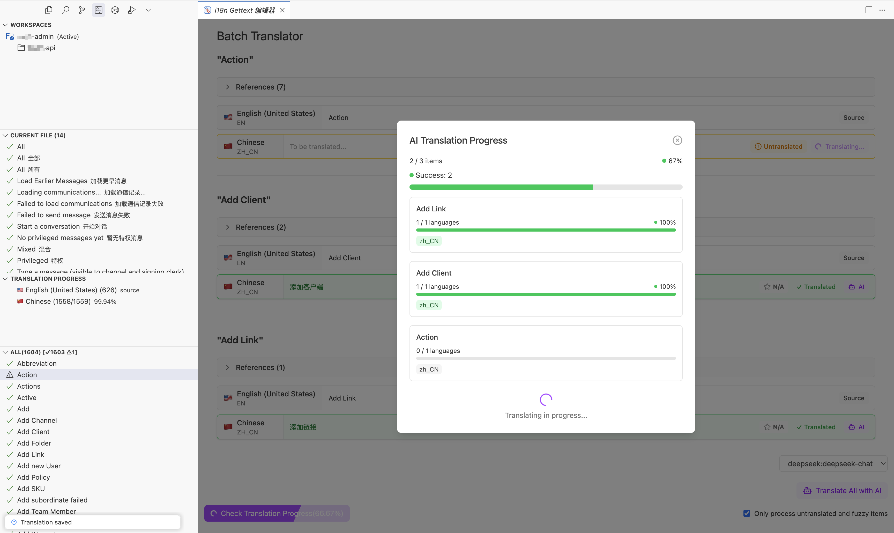

# i18n Gettext for VSCode


> [!NOTE]
> This repository is only for submitting and responding to issues and feedback.

English | [简体中文](./README.zh-CN.md)

A VSCode extension for Gettext-based internationalization (i18n) translation management, helping you easily handle translation tasks in multilingual projects.

## Features

- 🌍 **Translation Management**: Centrally manage and edit PO translation files
- 🔍 **Quick Search**: Easily find and navigate translation entries
- 📊 **Translation Progress**: Visually display project translation completion status
- 🤖 **AI Translation**: Support for high-quality translation using various AI models, including Deepseek, OpenAI, Anthropic, Mistral, and more

- 📝 **Editor Integration**: Dedicated translation editing interface
- 🔗 **Reference Navigation**: Support direct navigation from code to corresponding translation entries
- 🔢 **Entry Filtering**: Filter entries by all/translated/untranslated status

## Installation

Search for "i18n Gettext" in the VSCode Extension Marketplace and click install.

## Requirements

- VSCode 1.89.0 or higher

## Usage

1. **Configure Translation File Path**:
   The extension defaults to translation files located at `src/language/${locale}/${domain}.po`. You can customize this according to your project structure.

   

2. **Access Translation Management Panel**:
   Click the "i18n Gettext" icon in the activity bar to open the translation management panel.

3. **View Current File Translations**:
   Open a file containing internationalization strings, and all translations from that file will be displayed in the translation panel.

   

4. **Batch Translation**:
   Click the [Check Untranslated Entries] button in the translation progress title bar to open the translation panel.

   

5. **Edit Translations**:
   Click the edit icon next to any translation entry to open the translation editor.

   

6. **View Translation Progress**:
   Check the translation completion status for each language in the "Translation Progress" view.

7. **Search Translation Entries**:
   Use the search functionality at the top of the translation panel to quickly find specific translation entries.

8. **Filter Translation Entries**:
   Use the filter buttons at the top of the translation panel to show all/translated/untranslated entries.

9. **Use AI Translation**:
   Select an AI model in the translation editor for single or batch translation.

   

## Configuration Options

In VSCode settings, you can find the "i18n Gettext" section with the following options:

Default configuration:

```json
{
  "i18n-gettext.requestTimeoutMs": 600000,
  "i18n-gettext.localesConfig": {
    "root": ".",
    "type": "nested",
    "basePath": "src/language",
    "pattern": "${locale}/${domain}.po",
    "defaultDomain": "app",
    "sourceLanguage": "en-US"
  },
  "i18n-gettext.translatorConfig": {
    "onlyTranslateUntranslatedAndFuzzy": true,
    "batch": {
      "pageSize": 20
    }
  },
  "i18n-gettext.aiConfig": {
    "additionalPrompts": [],
    "reviewAI": {
      "provider": "",
      "modelId": "",
      "apiKey": ""
    },
    "ai": []
  }
}
```

### Global

- **requestTimeoutMs**: Timeout for AI requests in milliseconds. Set to `0` to disable timeout. Default: `600000` (10 minutes).

### localesConfig

- **root**: Project root directory
- **type**: Translation file organization method, supports the following types:
  - **flat**: All translation files are in the same directory level, typically named as `${locale}.${domain}.po`
  - **nested**: Translation files organized by language code hierarchy, like `${locale}/${domain}.po`
  - **custom**: Custom organization, following the pattern defined in the pattern field
- **basePath**: Translation files directory (relative to project root)
- **pattern**: Translation file path pattern, using `${locale}` and `${domain}` placeholders, only effective when `type` is `custom`
- **defaultDomain**: Default domain name
- **sourceLanguage**: Source language code

### translatorConfig

- **onlyTranslateUntranslatedAndFuzzy**: Whether to only translate untranslated/fuzzy-flagged fields
- **batch**:
  - **pageSize**: Number of translation entries to display per batch in batch translation mode

## AI Translation Configuration

1. **Config in vscode settings for extension(recommended)**

2. Create a `.i18n-gettext.secret` configuration file in the project root or `.vscode` directory with the following format:

```ts
interface ModelConfig {
  provider: string
  modelId: string
  apiKey?: string
  baseURL?: string
  region?: string
}
```

```json
{
  // Additional Prompts
  "additionalPrompts": [],

  // AI model for translation quality review
  "reviewAI": {
    "provider": "openai",
    "modelId": "gpt-4o",
    "apiKey": "your-api-key"
  },

  // AI models for translation
  "ai": [
    {
      "provider": "openai",
      "modelId": "gpt-4o",
      "apiKey": "your-api-key"
    },
    {
      "provider": "anthropic",
      "modelId": "claude-3-opus-20240229",
      "apiKey": "your-api-key"
    },
    {
      "provider": "deepseek",
      "modelId": "deepseek-chat",
      "apiKey": "your-api-key"
    }
  ]
}
```

Supported AI providers include:
- openai
- deepseek
- ollama
- open-router
- qwen
- anthropic
- mistral
- groq
- cohere
- perplexity
- amazon-bedrock
- azure
- google-vertex
- And many other AI model providers

> For more information about AI model configuration, please refer to the [AI SDK documentation](https://ai-sdk.dev/docs/foundations/providers-and-models).

## Tips and Tricks

- Navigate directly to translation entries through code definitions
- Edit translations for multiple languages simultaneously in the translation editor
- Use search functionality to quickly locate translations that need modification in large projects
- Use AI batch translation to translate multiple languages simultaneously for improved efficiency
- Translation entry list supports filtering by all/translated/untranslated status for better management

## Issue Reporting

If you encounter any issues or have feature suggestions, please submit an issue on the [GitHub repository](https://github.com/akinoccc/i18n-gettext/issues).
