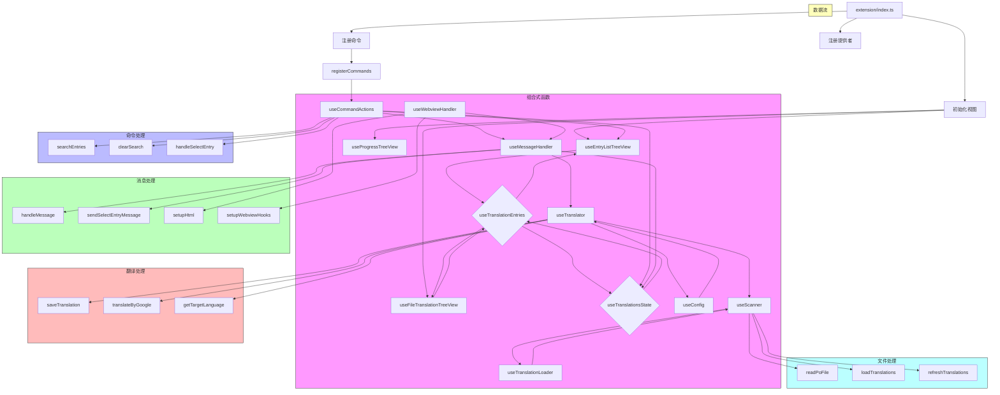

# i18n-gettext 扩展架构

## 组合式函数架构

i18n-gettext 扩展采用基于 Vue 3 Composition API 风格的组合式函数架构，使用 reactive-vscode 库提供的响应式 API。

### 核心原则

1. **使用组合式函数** - 所有功能都通过组合式函数实现，而非类
2. **单例模式** - 使用 `createSingletonComposable` 确保每个组合式函数只被实例化一次
3. **响应式状态** - 使用 Vue 的响应式系统管理状态
4. **明确依赖** - 通过组合式函数的调用关系明确表达依赖关系

### 架构流程图

## 主要组件

### 状态管理
- `useTranslationsState` - 管理翻译条目的全局状态
- `useTranslationEntries` - 处理翻译条目的过滤、搜索等操作

### 视图
- `useEntryListTreeView` - 提供翻译条目列表视图
- `useFileTranslationTreeView` - 提供当前文件翻译条目视图
- `useProgressTreeView` - 提供翻译进度视图

### 命令
- `useCommandActions` - 提供所有命令操作的实现

### 翻译与配置
- `useConfig` - 提供配置相关功能
- `useTranslator` - 提供翻译相关功能
- `useMessageHandler` - 提供消息处理功能
- `useWebviewHandler` - 提供 WebView 处理功能
- `useScanner` - 提供 PO 文件扫描和解析功能
- `useTranslationLoader` - 提供翻译加载和管理功能

## 优势

1. **代码更简洁** - 移除了冗余的类和方法
2. **状态共享更容易** - 使用响应式状态自动处理依赖关系
3. **依赖关系更清晰** - 通过函数调用关系明确表达依赖
4. **扩展性更好** - 易于添加新的组合式函数和功能
5. **一致性更好** - 所有功能都采用相同的组合式函数模式
6. **更好的类型安全** - TypeScript 类型定义更加明确
